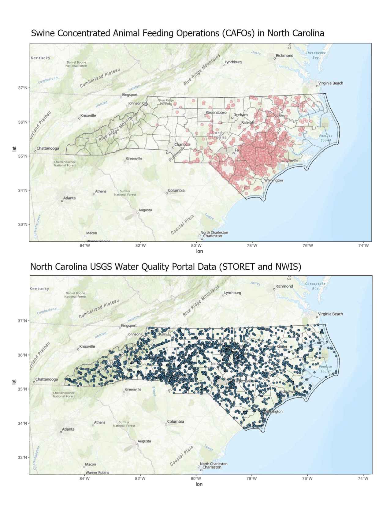
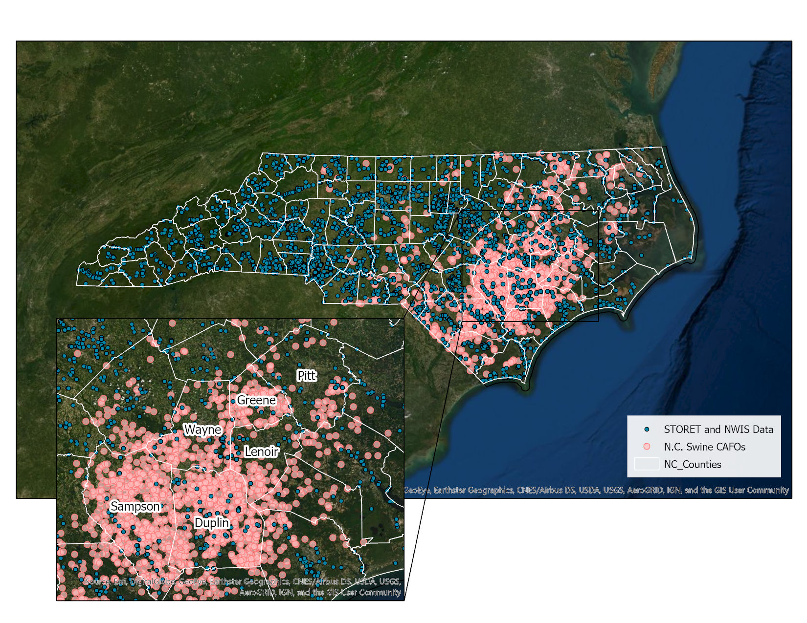
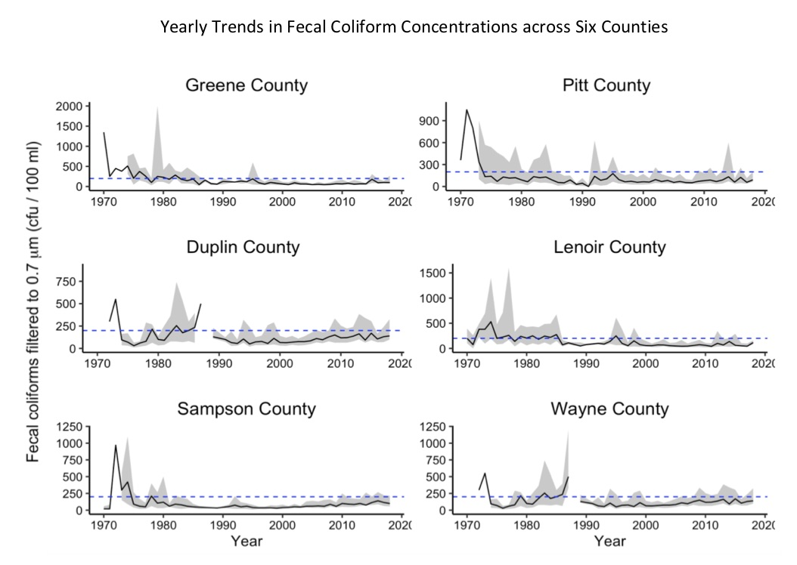
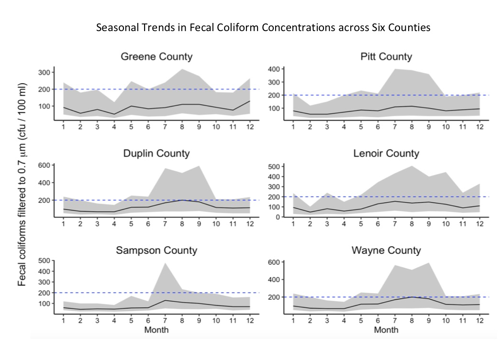

\newpage
\tableofcontents 
\newpage
\listoftables 
\newpage
\listoffigures 
\newpage

```{r setup, include=FALSE}
# Set your working directory
getwd()

# Load your packages
library(dataRetrieval)
library(tidyverse)
library(cowplot)
library(lubridate)
library(viridis)
library(readr)
library(dplyr)
library(agricolae)
library(knitr)

# Set your ggplot theme
mytheme <- theme_classic(base_size = 14) +
  theme(axis.text = element_text(color = "black"), 
        legend.position = "right")
theme_set(mytheme)

## Load your datasets
#import dataset
all_fecal_coliform_data_results <-read_csv("./all_fecal_coliform_data_results.csv")
all_fecal_coliform_stations <-read_csv("./all_fecal_coliform_stations.csv")

#join the two datasets together via the "MonitoringLocationIdentifier" column
All_fc_date <- left_join(all_fecal_coliform_data_results , all_fecal_coliform_stations, by= "MonitoringLocationIdentifier")

#reset Date column as a date, include code for dates prior to 1970
class(All_fc_date$ActivityStartDate)
All_fc_date$ActivityStartDate <-as.Date(All_fc_date$ActivityStartDate, format= "%m/%d/%y")
All_fc_date$ActivityStartDate <-format(All_fc_date$ActivityStartDate, "%y%m%d")
create.early.dates <-(function(d){paste0(ifelse(d>191231,"19", "20"),d)})
All_fc_date$ActivityStartDate <-create.early.dates(All_fc_date$ActivityStartDate)
All_fc_date$ActivityStartDate<- as.Date(All_fc_date$ActivityStartDate, format= "%Y%m%d")

#All_fc$ActivityStartDate <- as.Date(All_fc$ActivityStartDate) 
#filter(All_fc, ActivityStartDate >= "1970-01-01", ActivityStartDate <= "2018-12-10")

All_fc <- All_fc_date%>%
  filter(ActivityStartDate > as.Date("1970-01-01"))%>%
  filter(ActivityStartDate < as.Date("2018-12-21"))

## data wrangle 
fecal_total.processed <- All_fc %>%
  select(Organization_Id = OrganizationIdentifier.x,
         Organization_Name = OrganizationFormalName.x,
         Monitoring_LocationID = MonitoringLocationIdentifier,
         Monitoring_Location_Name = MonitoringLocationName,
         Monitoring_Location_Type = MonitoringLocationTypeName,
         HUC_Code = HUCEightDigitCode,
         Lat = LatitudeMeasure,
         Long = LongitudeMeasure,
         County_Code = CountyCode, 
         Activity_Type_Code = ActivityTypeCode,
         Activity_Media_Name = ActivityMediaName,
         Activity_Media_Subdivision= ActivityMediaSubdivisionName,
         Date = ActivityStartDate,
         Activity_Start_Time = `ActivityStartTime/Time`,
         Hydrologic_Condition = HydrologicCondition,
         Hydrologic_Event = HydrologicEvent,
         Characteristic = CharacteristicName,
         FecalValue = ResultMeasureValue,
         Results_Units =`ResultMeasure/MeasureUnitCode`,
         Results_Status = ResultStatusIdentifier,
         Result_Value = ResultValueTypeName,
         USGPS_code =USGSPCode,
         Detection_Quantitation_Limit_text = DetectionQuantitationLimitTypeName,
         #Result_Laboratory_Comment = ResultLaboratoryCommentText,
         Provider_Org = ProviderName.y) 
 
fecal_total_processed <- filter(fecal_total.processed,  Monitoring_Location_Type!= "Well" )

#data-wrangle
fecal_total <- fecal_total_processed %>%
  select(Date, 
         County_Code, 
         FecalValue,
         Results_Units)

fecal_total$County_Code <-as.factor(fecal_total$County_Code)
fecal_total_processed$County_Code <-as.factor(fecal_total_processed$County_Code)

##statistical analysis
fecal_total$County_Code <- as.numeric(fecal_total$County_Code)

# Test for normality. 
# Note: the important assumption for GLMs is normality of residuals, 
# not necessarily normality of raw data. See below when we plot the model.
shapiro.test(fecal_total$FecalValue[fecal_total$County_Code == "55"])
shapiro.test(fecal_total$FecalValue[fecal_total$County_Code == "87"])
shapiro.test(fecal_total$FecalValue[fecal_total$County_Code == "1"])
shapiro.test(fecal_total$FecalValue[fecal_total$County_Code == "3"])
shapiro.test(fecal_total$FecalValue[fecal_total$County_Code == "5"])
shapiro.test(fecal_total$FecalValue[fecal_total$County_Code == "11"])
shapiro.test(fecal_total$FecalValue[fecal_total$County_Code == "15"])
shapiro.test(fecal_total$FecalValue[fecal_total$County_Code == "21"])
shapiro.test(fecal_total$FecalValue[fecal_total$County_Code == "23"])
shapiro.test(fecal_total$FecalValue[fecal_total$County_Code == "27"])
shapiro.test(fecal_total$FecalValue[fecal_total$County_Code == "31"])
shapiro.test(fecal_total$FecalValue[fecal_total$County_Code == "33"])
shapiro.test(fecal_total$FecalValue[fecal_total$County_Code == "35"])
shapiro.test(fecal_total$FecalValue[fecal_total$County_Code == "39"])
shapiro.test(fecal_total$FecalValue[fecal_total$County_Code == "41"])
shapiro.test(fecal_total$FecalValue[fecal_total$County_Code == "43"])
shapiro.test(fecal_total$FecalValue[fecal_total$County_Code == "45"])
shapiro.test(fecal_total$FecalValue[fecal_total$County_Code == "47"])
shapiro.test(fecal_total$FecalValue[fecal_total$County_Code == "51"])
shapiro.test(fecal_total$FecalValue[fecal_total$County_Code == "53"])
shapiro.test(fecal_total$FecalValue[fecal_total$County_Code == "55"])
shapiro.test(fecal_total$FecalValue[fecal_total$County_Code == "59"])
shapiro.test(fecal_total$FecalValue[fecal_total$County_Code == "61"])
shapiro.test(fecal_total$FecalValue[fecal_total$County_Code == "63"])
shapiro.test(fecal_total$FecalValue[fecal_total$County_Code == "65"])
shapiro.test(fecal_total$FecalValue[fecal_total$County_Code == "67"])
shapiro.test(fecal_total$FecalValue[fecal_total$County_Code == "69"])
shapiro.test(fecal_total$FecalValue[fecal_total$County_Code == "71"])
shapiro.test(fecal_total$FecalValue[fecal_total$County_Code == "73"])
shapiro.test(fecal_total$FecalValue[fecal_total$County_Code == "75"])
shapiro.test(fecal_total$FecalValue[fecal_total$County_Code == "79"])
shapiro.test(fecal_total$FecalValue[fecal_total$County_Code == "81"])
shapiro.test(fecal_total$FecalValue[fecal_total$County_Code == "83"])
shapiro.test(fecal_total$FecalValue[fecal_total$County_Code == "85"])
shapiro.test(fecal_total$FecalValue[fecal_total$County_Code == "87"])
shapiro.test(fecal_total$FecalValue[fecal_total$County_Code == "89"])
shapiro.test(fecal_total$FecalValue[fecal_total$County_Code == "91"])
shapiro.test(fecal_total$FecalValue[fecal_total$County_Code == "93"])
shapiro.test(fecal_total$FecalValue[fecal_total$County_Code == "95"])
shapiro.test(fecal_total$FecalValue[fecal_total$County_Code == "97"])
shapiro.test(fecal_total$FecalValue[fecal_total$County_Code == "99"])
#shapiro.test(fecal_total$FecalValue[fecal_total$County_Code == "113"])
#shapiro.test(fecal_total$FecalValue[fecal_total$County_Code == "115"])
#shapiro.test(fecal_total$FecalValue[fecal_total$County_Code == "117"])
#shapiro.test(fecal_total$FecalValue[fecal_total$County_Code == "121"])
#shapiro.test(fecal_total$FecalValue[fecal_total$County_Code == "123"])
#shapiro.test(fecal_total$FecalValue[fecal_total$County_Code == "125"])
#shapiro.test(fecal_total$FecalValue[fecal_total$County_Code == "127"])
#shapiro.test(fecal_total$FecalValue[fecal_total$County_Code == "129"])
#shapiro.test(fecal_total$FecalValue[fecal_total$County_Code == "131"])
#shapiro.test(fecal_total$FecalValue[fecal_total$County_Code == "133"])
#shapiro.test(fecal_total$FecalValue[fecal_total$County_Code == "135"])
#shapiro.test(fecal_total$FecalValue[fecal_total$County_Code == "137"])
#shapiro.test(fecal_total$FecalValue[fecal_total$County_Code == "139"])
#shapiro.test(fecal_total$FecalValue[fecal_total$County_Code == "141"])
#shapiro.test(fecal_total$FecalValue[fecal_total$County_Code == "143"])
#shapiro.test(fecal_total$FecalValue[fecal_total$County_Code == "145"])
#shapiro.test(fecal_total$FecalValue[fecal_total$County_Code == "147"])
#shapiro.test(fecal_total$FecalValue[fecal_total$County_Code == "149"])
#shapiro.test(fecal_total$FecalValue[fecal_total$County_Code == "151"])
#shapiro.test(fecal_total$FecalValue[fecal_total$County_Code == "153"])
#shapiro.test(fecal_total$FecalValue[fecal_total$County_Code == "155"])
#shapiro.test(fecal_total$FecalValue[fecal_total$County_Code == "157"])
#shapiro.test(fecal_total$FecalValue[fecal_total$County_Code == "159"])
#shapiro.test(fecal_total$FecalValue[fecal_total$County_Code == "161"])
#shapiro.test(fecal_total$FecalValue[fecal_total$County_Code == "163"])
#shapiro.test(fecal_total$FecalValue[fecal_total$County_Code == "165"])
#shapiro.test(fecal_total$FecalValue[fecal_total$County_Code == "167"])
#shapiro.test(fecal_total$FecalValue[fecal_total$County_Code == "169"])
#shapiro.test(fecal_total$FecalValue[fecal_total$County_Code == "171"])
#shapiro.test(fecal_total$FecalValue[fecal_total$County_Code == "173"])
#shapiro.test(fecal_total$FecalValue[fecal_total$County_Code == "175"])
#shapiro.test(fecal_total$FecalValue[fecal_total$County_Code == "177"])
#shapiro.test(fecal_total$FecalValue[fecal_total$County_Code == "179"])
#shapiro.test(fecal_total$FecalValue[fecal_total$County_Code == "181"])
#shapiro.test(fecal_total$FecalValue[fecal_total$County_Code == "185"])
#shapiro.test(fecal_total$FecalValue[fecal_total$County_Code == "187"])
#shapiro.test(fecal_total$FecalValue[fecal_total$County_Code == "189"])
#shapiro.test(fecal_total$FecalValue[fecal_total$County_Code == "191"])
#shapiro.test(fecal_total$FecalValue[fecal_total$County_Code == "193"])
#shapiro.test(fecal_total$FecalValue[fecal_total$County_Code == "195"])
#shapiro.test(fecal_total$FecalValue[fecal_total$County_Code == "197"])
#shapiro.test(fecal_total$FecalValue[fecal_total$County_Code == "199"])

#check to see if raw data is normally distributed
qqnorm(fecal_total$FecalValue); qqline(fecal_total$FecalValue) 
#does have a tail at the end by 4th quartile

# Test for equal variance Bartlett test would not run
bartlett.test(fecal_total$FecalValue ~ fecal_total$County_Code)
#P value is low and variances are not at all close to each other. 

##one-Way ANOVA test
# ANOVA is robust against departures from equal variance.

# Format ANOVA as aov
all_fc.anova <- aov(data = fecal_total, FecalValue ~ County_Code)
summary(all_fc.anova)
#there is a significant p value (P < 0.001)

fligner.test(fecal_total$FecalValue ~ fecal_total$County_Code)

#The Fligner-Killeen test of homogeneity of variances says that the variance across groups is not homogeneous, but with a p-value close to 0.05 (med chi-squared = 44111, p-value = 0.001 < 0.05). For this reason, for testing if there are significant dierences between the fecal coliform concentrations among N.C. counties, it is used a One-way ANOVA test and a Non-parametric equivalent of ANOVA, the Kruskal-Wallis Test.

all_fc.lm <- lm(data = fecal_total, FecalValue ~ County_Code)
summary(all_fc.lm)
#residual standard error: 149800 on 218233 degrees of freedom (18657 observations deleted due to missingness) Multiple R-squared:  0.002449,	Adjusted R-squared:  0.001996 F-statistic: 5.411 on 99 and 218233 DF,  p-value: < 2.2e-16
#shows that county 193, 153, 119, 117, 71, 67, 57, 7, are all signficantly different 

# ANOVA is robust against departures from normality.
plot(all_fc.lm)

#According to both test, there is a significant difference between the fecal coliform concentrations for the different counties in N.C. (ANOVA; F = 5.41, df = 99, p< 2.2e-16) and (Kruskal-Wallis chi-squared = 471.69, df = 2, p-value < 2.2e-16)

#To analyze which counties are different, two post hoc tests were used, a Tukey multiple comparisons of means test for ANOVA and a Dunn’s test for Kruskal-Wallis.

summary(aov(FecalValue~as.factor(County_Code), fecal_total))
TukeyHSD(aov(FecalValue~as.factor(County_Code), fecal_total))

Fecal.Totals.all.plot <- ggplot(fecal_total, aes(x = County_Code, y = FecalValue, color = County_Code)) +
  geom_boxplot() +
  scale_color_viridis_d()+
  theme(axis.text.x = element_text(angle = 90, hjust = 1)) + 
  labs(x = "N.C. County Code", y = expression("Fecal coliforms filtered to 0.7 " * mu *m *  " (cfu / 100 ml)")) +
  ylim(0, 1000)+
  theme(legend.position = "bottom", axis.text.x = element_text(angle = 90, size = 8, hjust=0.5, vjust = .5, face = "plain"), legend.title = element_text(color = "black", size = 8),legend.text = element_text(size = 5))+
  guides(col = guide_legend(ncol = 18), shape = guide_legend(override.aes = list(size = 1)))
print(Fecal.Totals.all.plot)

fecalc.kw <- kruskal.test(fecal_total$FecalValue ~ fecal_total$County_Code)
fecalc.kw #chi-squared statistics = 33796, p-valye < 2.2e-16

##Exploratory Plots

#Figure 2
Figure_2 <- ggplot(fecal_total_processed, aes(x=County_Code, y=FecalValue, color = County_Code))+
  geom_line()+
  scale_color_viridis_d()+
  ylim(0, 15000) +
  labs(x = "N.C. County", y = expression("Fecal coliforms filtered to 0.7 " * mu *m *  " (cfu / 100 ml)"))+
  theme(legend.position = "bottom", axis.text.x = element_text(angle = 90, size = 8, hjust=0.5, vjust = .5, face = "plain"), legend.title = element_text(color = "black", size = 8),legend.text = element_text(size = 5))+
  guides(col = guide_legend(ncol = 20), shape = guide_legend(override.aes = list(size = 3)))
print(Figure_2 + ggtitle("Fecal Coliform Concentrations by County"))

##Exploratory Graph

fecal_exceed <- filter(fecal_total, FecalValue >= 200 )%>%
  na.omit()

#Exploratory exceedance graph
#fecal_exceed.plot <-ggplot(fecal_exceed, aes(x = County_Code, y=FecalValue, color = County_Code )) +
 #geom_point() +
 #scale_color_viridis_d()+
  #ylim(200, 50000)+
  #labs(x = "N.C. County", y = expression("Fecal coliforms filtered to 0.7 " * mu *m *  " (cfu / 100 ml)"))+
 # theme(legend.position = "bottom", axis.text.x = element_text(angle = 90, size = 8, hjust=0.5, vjust = .5, face = "plain"), legend.title = element_text(color = "black", size = 8),legend.text = element_text(size = 5))+
 # guides(col = guide_legend(ncol = 18), shape = guide_legend(override.aes = list(size = 1)))
#print(fecal_exceed.plot+ ggtitle("N.C. Counties that Exceed 200 cfu/100ml Threshold"))

#exploratory bar graph
explore.bar.graph <-ggplot(fecal_total, aes(x =County_Code)) +
  geom_bar()+
  labs(x = "N.C. County", y= "Samples Collected")+
  theme(axis.text.x = element_text(angle = 90, size = 8))
print(explore.bar.graph+ ggtitle("Exploratory Bar Graph"))

#exploratory box plot
explore.box <- ggplot(fecal_total) +
  geom_boxplot(aes(x = County_Code, y = FecalValue, color= County_Code))+
  scale_color_viridis_d()+
  ylim(0, 1000)+
  labs(x = "N.C. County", y = expression("Fecal coliforms filtered to 0.7 " * mu *m *  " (cfu / 100 ml)"))+
  theme(legend.position = "bottom", axis.text.x = element_text(angle = 90, size = 7))+
  guides(col = guide_legend(ncol = 20))
print(explore.box + ggtitle("Exploratory Box Plot"))


#exploratory scatter plot
#explore.scatter.county <-ggplot(fecal_total) +
 # geom_point(aes(x = County_Code, y = FecalValue, color = County_Code))+
 # scale_color_viridis_d(option = "magma")+
 # ylim(0, 0000)+
 # labs(x = "N.C. County", y = expression("Fecal coliforms filtered to 0.7 " * mu *m *  " (cfu / 100 ml)"))+
#  theme(legend.position = "bottom", axis.text.x = element_text(angle = 90, size = 7))+
#  guides(col = guide_legend(ncol = 15))
#print(explore.scatter.county + ggtitle("Exploratory Scatter Plot"))

explore.scatter.date <-  ggplot(fecal_total) +
  geom_line(aes(x = Date, y = FecalValue))+
  ylim(0, 50000)+
  labs(x = "Year", y = expression("Fecal coliforms filtered to 0.7 " * mu *m *  " (cfu / 100 ml)"))
print(explore.scatter.date + ggtitle("Exploratory Concentrations over Time Scatter Plot"))

fecal_total$County_Code <- as.numeric(fecal_total$County_Code)

###Exploratory graphs for case study
#data import and wrangle- Greene

#Greene County
#had one of the highest ranking fecal colimform data in all of N.C. some samples over 10,000 cfu/100ml

#import Greene count data sets for site infromation and results
Green_sample_results <-read_csv("./Green_sample_results.csv")
Green_station <-read_csv("./Green_station.csv")

#join the two datasets together via the "MonitoringLocationIdentifier" column
Greene.processed <- left_join(Green_sample_results, Green_station, by= "MonitoringLocationIdentifier")

# Set date to date format
Greene.processed$ActivityStartDate <- as.Date(Greene.processed$ActivityStartDate, format ="%m/%d/%y")
Greene.processed$ActivityStartDate <-format(Greene.processed$ActivityStartDate, "%y%m%d")
create.early.dates <-(function(d){paste0(ifelse(d>191231,"19", "20"),d)})
Greene.processed$ActivityStartDate <-create.early.dates(Greene.processed$ActivityStartDate)
Greene.processed$ActivityStartDate<- as.Date(Greene.processed$ActivityStartDate, format= "%Y%m%d")

Greene.processed.dates<- Greene.processed%>%
  filter(ActivityStartDate > as.Date("1970-01-01"))%>%
  filter(ActivityStartDate < as.Date("2018-12-21"))

#data-wrangling
Greene_fecal <- Greene.processed.dates%>%
  select(Date = ActivityStartDate, 
         Fecal_Coliform_Value = ResultMeasureValue,
         Units = `ResultMeasure/MeasureUnitCode`,
         )
#plots
Greene.F.coli.plot <- ggplot(Greene_fecal, aes(x = Date)) +
  geom_line(aes(y = Fecal_Coliform_Value)) +
  ylim(0, 10200)+
  labs(x = "Year", 
       y = expression("Fecal coliforms filtered to 0.7 " * mu *m *  " (cfu / 100 ml)")) 
print(Greene.F.coli.plot)

#yearly changes in data
Greene.year.obs <- Greene_fecal %>%
  mutate(year = year(Date)) %>%
  group_by(year) %>%
  select(-Date) 

Greene.coli.year.summaries <- Greene_fecal %>%
  mutate(year = year(Date)) %>%
  group_by(year) %>%
  select(year, Fecal_Coliform_Value) %>%
  summarize_all(funs(Median = median(., na.rm = T),
                 quant25 = quantile(., .25, na.rm = T),
                 quant75 = quantile(., .75, na.rm = T)))

Greene.coli.years <- ggplot(Greene.coli.year.summaries, aes(x = year)) +
  geom_ribbon(aes(ymin = quant25, ymax = quant75), alpha = 0.3) +
  geom_line(aes(y = Median)) +
  geom_hline(yintercept=200, linetype="dashed", color = "blue")+
  scale_x_continuous(name = "Year")+
                     #breaks = c(1,2,3,4,5,6,7,8,9,10,11,12)) +
  ggtitle("Greene County")+
  theme(plot.title = element_text(hjust = 0.5))+
  ylim(0, 2000)+
    labs(y = expression("Fecal coliforms filtered to 0.7 " * mu *m *  " (cfu / 100 ml)")) 
print(Greene.coli.years)

# monthly changes in data
Greene.monthly.obs <- Greene_fecal %>%
  mutate(month = month(Date)) %>%
  group_by(month) %>%
  select(-Date)
  
Greene.coli.monthly.summaries <- Greene_fecal %>%
  mutate(month = month(Date)) %>%
  group_by(month) %>%
  select(month, Fecal_Coliform_Value) %>%
  summarize_all(funs(Median = median(., na.rm = T),
                 quant25 = quantile(., .25, na.rm = T),
                 quant75 = quantile(., .75, na.rm = T)))

Greene.coli.seasons <- ggplot(Greene.coli.monthly.summaries, aes(x = month)) +
  geom_ribbon(aes(ymin = quant25, ymax = quant75), alpha = 0.3) +
  geom_line(aes(y = Median)) +
  geom_hline(yintercept=200, linetype="dashed", color = "blue")+
  scale_x_continuous(name = "Month",
                     breaks = c(1,2,3,4,5,6,7,8,9,10,11,12)) +
  ggtitle("Greene County")+
  theme(plot.title = element_text(hjust = 0.5))+
    labs(y = expression("Fecal coliforms filtered to 0.7 " * mu *m *  " (cfu / 100 ml)")) 
print(Greene.coli.seasons)

#stat analysis Greene
Greene_fc.anova <- aov(data = Greene_fecal, Fecal_Coliform_Value ~ as.factor(Date))
summary(all_fc.anova)
#sig df= 99, F value = 5.411 p <0.001

options(max.print=999999)
Greene_fc.lm <- lm(data = Greene_fecal, Fecal_Coliform_Value ~ as.factor(Date))
summary(Greene_fc.lm)
#sig difference 

##Exploratory Case Study- Pitt
##Pitt County
#had one of the highest ranking fecal colimform data in all of N.C. some samples over 10,000 cfu/100ml

#import Pitt count data sets for site infromation and results

#join the two datasets together via the "MonitoringLocationIdentifier" column
Pitt.processed <- left_join(Pitt_biologicalresults, Pitt_station, by= "MonitoringLocationIdentifier")

# Set date to date format
Pitt.processed$ActivityStartDate <- as.Date(Pitt.processed$ActivityStartDate, format ="%m/%d/%y")
Pitt.processed$ActivityStartDate <-format(Pitt.processed$ActivityStartDate, "%y%m%d")
create.early.dates <-(function(d){paste0(ifelse(d>191231,"19", "20"),d)})
Pitt.processed$ActivityStartDate <-create.early.dates(Pitt.processed$ActivityStartDate)
Pitt.processed$ActivityStartDate<- as.Date(Pitt.processed$ActivityStartDate, format= "%Y%m%d")

Pitt.processed.dates<- Pitt.processed%>%
  filter(ActivityStartDate > as.Date("1970-01-01"))%>%
  filter(ActivityStartDate < as.Date("2018-12-21"))

#data-wrangling
Pitt_fecal <- Pitt.processed.dates%>%
  select(Date = ActivityStartDate, 
         Fecal_Coliform_Value = ResultMeasureValue,
         Units = `ResultMeasure/MeasureUnitCode`)

#plots
Pitt.F.coli.plot <- ggplot(Pitt_fecal, aes(x = Date)) +
  geom_line(aes(y = Fecal_Coliform_Value)) +
  ylim(0, 10200)+
  labs(x = "Year", 
       y = expression("Fecal coliforms filtered to 0.7 " * mu *m *  " (cfu / 100 ml)")) 
print(Pitt.F.coli.plot)

#yearly changes in data
Pitt.year.obs <- Pitt_fecal %>%
  mutate(year = year(Date)) %>%
  group_by(year) %>%
  select(-Date) 

Pitt.coli.year.summaries <- Pitt_fecal %>%
  mutate(year = year(Date)) %>%
  group_by(year) %>%
  select(year, Fecal_Coliform_Value) %>%
  summarize_all(funs(Median = median(., na.rm = T),
                 quant25 = quantile(., .25, na.rm = T),
                 quant75 = quantile(., .75, na.rm = T)))

Pitt.coli.years <- ggplot(Pitt.coli.year.summaries, aes(x = year)) +
  geom_ribbon(aes(ymin = quant25, ymax = quant75), alpha = 0.3) +
  geom_line(aes(y = Median)) +
  geom_hline(yintercept=200, linetype="dashed", color = "blue")+
  scale_x_continuous(name = "Year")+
                     #breaks = c(1,2,3,4,5,6,7,8,9,10,11,12)) +
  ggtitle("Pitt County")+
  theme(plot.title = element_text(hjust = 0.5))+
  ylim(0, 1100)+
    labs(y = expression("Fecal coliforms filtered to 0.7 " * mu *m *  " (cfu / 100 ml)")) 
print(Pitt.coli.years)

# monthly changes in data
Pitt.monthly.obs <- Pitt_fecal %>%
  mutate(month = month(Date)) %>%
  group_by(month) %>%
  select(-Date)
  
Pitt.coli.monthly.summaries <- Pitt_fecal %>%
  mutate(month = month(Date)) %>%
  group_by(month) %>%
  select(month, Fecal_Coliform_Value) %>%
  summarize_all(funs(Median = median(., na.rm = T),
                 quant25 = quantile(., .25, na.rm = T),
                 quant75 = quantile(., .75, na.rm = T)))

Pitt.coli.seasons <- ggplot(Pitt.coli.monthly.summaries, aes(x = month)) +
  geom_ribbon(aes(ymin = quant25, ymax = quant75), alpha = 0.3) +
  geom_line(aes(y = Median)) +
  geom_hline(yintercept=200, linetype="dashed", color = "blue")+
  scale_x_continuous(name = "Month",
                     breaks = c(1,2,3,4,5,6,7,8,9,10,11,12)) +
    ggtitle("Pitt County")+
  theme(plot.title = element_text(hjust = 0.5))+
    labs(y = expression("Fecal coliforms filtered to 0.7 " * mu *m *  " (cfu / 100 ml)")) 
print(Pitt.coli.seasons)

#stat analysis-pitt
Pitt_fc.anova <- aov(data = Pitt_fecal, Fecal_Coliform_Value ~ as.factor(Date))
summary(Pitt_fc.anova)
#sig df= 99, F value = 2.615 p <0.001

Pitt_fc.lm <- lm(data = Pitt_fecal, Fecal_Coliform_Value ~ as.factor(Date))
summary(Pitt_fc.lm)

#sig difference  Multiple R-squared:  0.6862,	Adjusted R-squared:  0.4238 
#F-statistic: 2.615 on 1534 and 1834 DF,  p-value: < 2.2e-16

#Case Study Exploration Duplin

#import Duplin count data sets for site infromation and results
Duplin_sample_results <-read_csv("./Duplin_results.csv")
Duplin_station <-read_csv("./duplin_station.csv")

#join the two datasets together via the "MonitoringLocationIdentifier" column
Duplin.processed <- left_join(Duplin_sample_results, Duplin_station, by= "MonitoringLocationIdentifier")

# Set date to date format
Duplin.processed$ActivityStartDate <- as.Date(Duplin.processed$ActivityStartDate, format ="%m/%d/%y")
Duplin.processed$ActivityStartDate <-format(Duplin.processed$ActivityStartDate, "%y%m%d")
create.early.dates <-(function(d){paste0(ifelse(d>191231,"19", "20"),d)})
Duplin.processed$ActivityStartDate <-create.early.dates(Duplin.processed$ActivityStartDate)
Duplin.processed$ActivityStartDate <- as.Date(Duplin.processed$ActivityStartDate, format= "%Y%m%d")

Duplin.processed.dates<- Duplin.processed%>%
  filter(ActivityStartDate > as.Date("1970-01-01"))%>%
  filter(ActivityStartDate < as.Date("2018-12-21"))

#data-wrangling
Duplin_fecal <- Duplin.processed.dates%>%
  select(Date = ActivityStartDate, 
         Fecal_Coliform_Value = ResultMeasureValue,
         Units = `ResultMeasure/MeasureUnitCode`)

Duplin.F.coli.plot <- ggplot(Duplin_fecal, aes(x = Date)) +
  geom_line(aes(y = Fecal_Coliform_Value)) +
  ylim(0, 10200)+
  labs(x = "Year", 
       y = expression("Fecal coliforms filtered to 0.7 " * mu *m *  " (cfu / 100 ml)")) 
print(Duplin.F.coli.plot)

#yearly changes in data
Duplin.year.obs <- Duplin_fecal %>%
  mutate(year = year(Date)) %>%
  group_by(year) %>%
  select(-Date) 

Duplin.coli.year.summaries <- Duplin_fecal %>%
  mutate(year = year(Date)) %>%
  group_by(year) %>%
  select(year, Fecal_Coliform_Value) %>%
  summarize_all(funs(Median = median(., na.rm = T),
                 quant25 = quantile(., .25, na.rm = T),
                 quant75 = quantile(., .75, na.rm = T)))

Duplin.coli.years <- ggplot(Duplin.coli.year.summaries, aes(x = year)) +
  geom_ribbon(aes(ymin = quant25, ymax = quant75), alpha = 0.3) +
  geom_line(aes(y = Median)) +
  geom_hline(yintercept=200, linetype="dashed", color = "blue")+
  scale_x_continuous(name = "Year")+
                     #breaks = c(1,2,3,4,5,6,7,8,9,10,11,12)) +
  ggtitle("Duplin County")+
  theme(plot.title = element_text(hjust = 0.5))+
  ylim(0, 900)+
    labs(y = expression("Fecal coliforms filtered to 0.7 " * mu *m *  " (cfu / 100 ml)")) 
print(Duplin.coli.years)

# monthly changes in data
Duplin.monthly.obs <- Duplin_fecal %>%
  mutate(month = month(Date)) %>%
  group_by(month) %>%
  select(-Date)
  
Duplin.coli.monthly.summaries <- Duplin_fecal %>%
  mutate(month = month(Date)) %>%
  group_by(month) %>%
  select(month, Fecal_Coliform_Value) %>%
  summarize_all(funs(Median = median(., na.rm = T),
                 quant25 = quantile(., .25, na.rm = T),
                 quant75 = quantile(., .75, na.rm = T)))

Duplin.coli.seasons <- ggplot(Duplin.coli.monthly.summaries, aes(x = month)) +
  geom_ribbon(aes(ymin = quant25, ymax = quant75), alpha = 0.3) +
  geom_line(aes(y = Median)) +
  geom_hline(yintercept=200, linetype="dashed", color = "blue")+
  scale_x_continuous(name = "Month",
                     breaks = c(1,2,3,4,5,6,7,8,9,10,11,12)) +
  ggtitle("Duplin County")+
  theme(plot.title = element_text(hjust = 0.5))+
    labs(y = expression("Fecal coliforms filtered to 0.7 " * mu *m *  " (cfu / 100 ml)")) 
print(Duplin.coli.seasons)

#stat analysis Duplin
Duplin_fc.anova <- aov(data = Duplin_fecal, Fecal_Coliform_Value ~ as.factor(Date))
summary(Pitt_fc.anova)
#sig df= 99, F value = 2.615 p <0.001

Duplin_fc.lm <- lm(data = Duplin_fecal, Fecal_Coliform_Value ~ as.factor(Date))
summary(Pitt_fc.lm)

#Lenoir county 
#import Lenoir count data sets for site infromation and results
Lenoir_results <-read_csv("./LeNoir_results.csv")
Lenoir_station <-read_csv("./lenoir_station.csv")

#join the two datasets together via the "MonitoringLocationIdentifier" column
Lenoir.processed <- left_join(Lenoir_results, Lenoir_station, by= "MonitoringLocationIdentifier")

# Set date to date format
Lenoir.processed$ActivityStartDate <- as.Date(Lenoir.processed$ActivityStartDate, format ="%m/%d/%y")
Lenoir.processed$ActivityStartDate <-format(Lenoir.processed$ActivityStartDate, "%y%m%d")
create.early.dates <-(function(d){paste0(ifelse(d>191231,"19", "20"),d)})
Lenoir.processed$ActivityStartDate <-create.early.dates(Lenoir.processed$ActivityStartDate)
Lenoir.processed$ActivityStartDate <- as.Date(Lenoir.processed$ActivityStartDate, format= "%Y%m%d")

Lenoir.processed.dates<- Lenoir.processed%>%
  filter(ActivityStartDate > as.Date("1970-01-01"))%>%
  filter(ActivityStartDate < as.Date("2018-12-21"))

#data-wrangling
Lenoir_fecal <- Lenoir.processed.dates%>%
  select(Date = ActivityStartDate, 
         Fecal_Coliform_Value = ResultMeasureValue,
         Units = `ResultMeasure/MeasureUnitCode`) 

#plots
Lenoir.F.coli.plot <- ggplot(Lenoir_fecal, aes(x = Date)) +
  geom_line(aes(y = Fecal_Coliform_Value)) +
  ylim(0, 10200)+
  labs(x = "Year", 
       y = expression("Fecal coliforms filtered to 0.7 " * mu *m *  " (cfu / 100 ml)")) 
print(Lenoir.F.coli.plot)

#yearly changes in data
Lenoir.year.obs <- Lenoir_fecal %>%
  mutate(year = year(Date)) %>%
  group_by(year) %>%
  select(-Date) 

Lenoir.coli.year.summaries <- Lenoir_fecal %>%
  mutate(year = year(Date)) %>%
  group_by(year) %>%
  select(year, Fecal_Coliform_Value) %>%
  summarize_all(funs(Median = median(., na.rm = T),
                 quant25 = quantile(., .25, na.rm = T),
                 quant75 = quantile(., .75, na.rm = T)))

Lenoir.coli.years <- ggplot(Lenoir.coli.year.summaries, aes(x = year)) +
  geom_ribbon(aes(ymin = quant25, ymax = quant75), alpha = 0.3) +
  geom_line(aes(y = Median)) +
  geom_hline(yintercept=200, linetype="dashed", color = "blue")+
  scale_x_continuous(name = "Year")+
                     #breaks = c(1,2,3,4,5,6,7,8,9,10,11,12)) +
  ggtitle("Lenoir County")+
  theme(plot.title = element_text(hjust = 0.5))+
  ylim(0, 1600)+
    labs(y = expression("Fecal coliforms filtered to 0.7 " * mu *m *  " (cfu / 100 ml)")) 
print(Lenoir.coli.years)

# monthly changes in data
Lenoir.monthly.obs <- Lenoir_fecal %>%
  mutate(month = month(Date)) %>%
  group_by(month) %>%
  select(-Date)
  
Lenoir.coli.monthly.summaries <- Lenoir_fecal %>%
  mutate(month = month(Date)) %>%
  group_by(month) %>%
  select(month, Fecal_Coliform_Value) %>%
  summarize_all(funs(Median = median(., na.rm = T),
                 quant25 = quantile(., .25, na.rm = T),
                 quant75 = quantile(., .75, na.rm = T)))

Lenoir.coli.seasons <- ggplot(Lenoir.coli.monthly.summaries, aes(x = month)) +
  geom_ribbon(aes(ymin = quant25, ymax = quant75), alpha = 0.3) +
  geom_line(aes(y = Median)) +
  geom_hline(yintercept=200, linetype="dashed", color = "blue")+
  scale_x_continuous(name = "Month",
                     breaks = c(1,2,3,4,5,6,7,8,9,10,11,12)) +
   ggtitle("Lenoir County")+
  theme(plot.title = element_text(hjust = 0.5))+
    labs(y = expression("Fecal coliforms filtered to 0.7 " * mu *m *  " (cfu / 100 ml)")) 
print(Lenoir.coli.seasons)
#stat analysis lenoir
lenoir_fc.anova <- aov(data = Lenoir_fecal, Fecal_Coliform_Value ~ as.factor(Date))
summary(lenoir_fc.anova)
#sig df= 99, F value = 3.059 p <0.001


Lenoir_fc.lm <- lm(data = Lenoir_fecal, Fecal_Coliform_Value ~ as.factor(Date))
summary(Lenoir_fc.lm)
#Multiple R-squared:  0.7389,	Adjusted R-squared:  0.4974 
#F-statistic: 3.059 on 976 and 1055 DF,  p-value: < 2.2e-16

##Case study of Sampson
#import Sampson count data sets for site infromation and results
Sampson_results <-read_csv("./Sampson_results.csv")
Sampson_station <-read_csv("./Sampson_station.csv")

#join the two datasets together via the "MonitoringLocationIdentifier" column
Sampson.processed <- left_join(Sampson_results, Sampson_station, by= "MonitoringLocationIdentifier")

# Set date to date format
Sampson.processed$ActivityStartDate <- as.Date(Sampson.processed$ActivityStartDate, format ="%m/%d/%y")
Sampson.processed$ActivityStartDate <-format(Sampson.processed$ActivityStartDate, "%y%m%d")
create.early.dates <-(function(d){paste0(ifelse(d>191231,"19", "20"),d)})
Sampson.processed$ActivityStartDate <-create.early.dates(Sampson.processed$ActivityStartDate)
Sampson.processed$ActivityStartDate <- as.Date(Sampson.processed$ActivityStartDate, format= "%Y%m%d")

Sampson.processed.dates<- Sampson.processed%>%
  filter(ActivityStartDate > as.Date("1970-01-01"))%>%
  filter(ActivityStartDate < as.Date("2018-12-21"))

#data-wrangling
Sampson_fecal <- Sampson.processed.dates%>%
  select(Date = ActivityStartDate, 
         Fecal_Coliform_Value = ResultMeasureValue,
         Units = `ResultMeasure/MeasureUnitCode`) 

#plots
Sampson.F.coli.plot <- ggplot(Sampson_fecal, aes(x = Date)) +
  geom_line(aes(y = Fecal_Coliform_Value)) +
  ylim(0, 10200)+
  labs(x = "Year", 
       y = expression("Fecal coliforms filtered to 0.7 " * mu *m *  " (cfu / 100 ml)")) 
print(Sampson.F.coli.plot)

#yearly changes in data
Sampson.year.obs <- Sampson_fecal %>%
  mutate(year = year(Date)) %>%
  group_by(year) %>%
  select(-Date) 

Sampson.coli.year.summaries <- Sampson_fecal %>%
  mutate(year = year(Date)) %>%
  group_by(year) %>%
  select(year, Fecal_Coliform_Value) %>%
  summarize_all(funs(Median = median(., na.rm = T),
                 quant25 = quantile(., .25, na.rm = T),
                 quant75 = quantile(., .75, na.rm = T)))

Sampson.coli.years <- ggplot(Sampson.coli.year.summaries, aes(x = year)) +
  geom_ribbon(aes(ymin = quant25, ymax = quant75), alpha = 0.3) +
  geom_line(aes(y = Median)) +
  geom_hline(yintercept=200, linetype="dashed", color = "blue")+
  scale_x_continuous(name = "Year")+
                     #breaks = c(1,2,3,4,5,6,7,8,9,10,11,12)) +
  ylim(0, 1200)+
  ggtitle("Sampson County")+
  theme(plot.title = element_text(hjust = 0.5))+
    labs(y = expression("Fecal coliforms filtered to 0.7 " * mu *m *  " (cfu / 100 ml)")) 
print(Sampson.coli.years)

# monthly changes in data
Sampson.monthly.obs <- Sampson_fecal %>%
  mutate(month = month(Date)) %>%
  group_by(month) %>%
  select(-Date)
  
Sampson.coli.monthly.summaries <- Sampson_fecal %>%
  mutate(month = month(Date)) %>%
  group_by(month) %>%
  select(month, Fecal_Coliform_Value) %>%
  summarize_all(funs(Median = median(., na.rm = T),
                 quant25 = quantile(., .25, na.rm = T),
                 quant75 = quantile(., .75, na.rm = T)))

Sampson.coli.seasons <- ggplot(Sampson.coli.monthly.summaries, aes(x = month)) +
  geom_ribbon(aes(ymin = quant25, ymax = quant75), alpha = 0.3) +
  geom_line(aes(y = Median)) +
  geom_hline(yintercept=200, linetype="dashed", color = "blue")+
  scale_x_continuous(name = "Month",
                     breaks = c(1,2,3,4,5,6,7,8,9,10,11,12)) +
  ggtitle("Sampson County")+
  theme(plot.title = element_text(hjust = 0.5))+
    labs(y = expression("Fecal coliforms filtered to 0.7 " * mu *m *  " (cfu / 100 ml)")) 
print(Sampson.coli.seasons)


#stat Sampson
Sampson_fc.anova <- aov(data = Sampson_fecal, Fecal_Coliform_Value ~ as.factor(Date))
summary(Sampson_fc.anova)
#sig df= 866, F value = 99.3 p <0.001

Sampson_fc.lm <- lm(data = Sampson_fecal, Fecal_Coliform_Value ~ as.factor(Date))
summary(Sampson_fc.lm)
#Multiple R-squared:  0.9778,	Adjusted R-squared:  0.968 
#F-statistic: 99.32 on 866 and 1953 DF,  p-value: < 2.2e-16


#Wayne County Exploration
Wayne_results <-read_csv("./wayne_results.csv")
Wayne_station <-read_csv("./wayne_station.csv")

#import Wayne count data sets for site infromation and results
#join the two datasets together via the "MonitoringLocationIdentifier" column
Wayne.processed <- left_join(Wayne_results, Wayne_station, by= "MonitoringLocationIdentifier")

# Set date to date format
Wayne.processed$ActivityStartDate <- as.Date(Wayne.processed$ActivityStartDate, format ="%m/%d/%y")
Wayne.processed$ActivityStartDate <-format(Wayne.processed$ActivityStartDate, "%y%m%d")
create.early.dates <-(function(d){paste0(ifelse(d>191231,"19", "20"),d)})
Wayne.processed$ActivityStartDate <-create.early.dates(Wayne.processed$ActivityStartDate)
Wayne.processed$ActivityStartDate <- as.Date(Wayne.processed$ActivityStartDate, format= "%Y%m%d")

Wayne.processed.dates<- Duplin.processed%>%
  filter(ActivityStartDate > as.Date("1970-01-01"))%>%
  filter(ActivityStartDate < as.Date("2018-12-21"))

#data-wrangling
Wayne_fecal <- Wayne.processed.dates%>%
  select(Date = ActivityStartDate, 
         Fecal_Coliform_Value = ResultMeasureValue,
         Units = `ResultMeasure/MeasureUnitCode`) 

#plots
Wayne.F.coli.plot <- ggplot(Wayne_fecal, aes(x = Date)) +
  geom_line(aes(y = Fecal_Coliform_Value)) +
  ylim(0, 10200)+
  labs(x = "Year", 
       y = expression("Fecal coliforms filtered to 0.7 " * mu *m *  " (cfu / 100 ml)")) 
print(Wayne.F.coli.plot)

#yearly changes in data
Wayne.year.obs <- Wayne_fecal %>%
  mutate(year = year(Date)) %>%
  group_by(year) %>%
  select(-Date) 

Wayne.coli.year.summaries <- Wayne_fecal %>%
  mutate(year = year(Date)) %>%
  group_by(year) %>%
  select(year, Fecal_Coliform_Value) %>%
  summarize_all(funs(Median = median(., na.rm = T),
                 quant25 = quantile(., .25, na.rm = T),
                 quant75 = quantile(., .75, na.rm = T)))

Wayne.coli.years <- ggplot(Wayne.coli.year.summaries, aes(x = year)) +
  geom_ribbon(aes(ymin = quant25, ymax = quant75), alpha = 0.3) +
  geom_line(aes(y = Median)) +
  geom_hline(yintercept=200, linetype="dashed", color = "blue")+
  scale_x_continuous(name = "Year")+
                     #breaks = c(1,2,3,4,5,6,7,8,9,10,11,12)) +
  ggtitle("Wayne County")+
  theme(plot.title = element_text(hjust = 0.5))+
  ylim(0, 1200)+
    labs(y = expression("Fecal coliforms filtered to 0.7 " * mu *m *  " (cfu / 100 ml)")) 
print(Wayne.coli.years)

# monthly changes in data
Wayne.monthly.obs <- Wayne_fecal %>%
  mutate(month = month(Date)) %>%
  group_by(month) %>%
  select(-Date)
  
Wayne.coli.monthly.summaries <- Wayne_fecal %>%
  mutate(month = month(Date)) %>%
  group_by(month) %>%
  select(month, Fecal_Coliform_Value) %>%
  summarize_all(funs(Median = median(., na.rm = T),
                 quant25 = quantile(., .25, na.rm = T),
                 quant75 = quantile(., .75, na.rm = T)))

Wayne.coli.seasons <- ggplot(Wayne.coli.monthly.summaries, aes(x = month)) +
  geom_ribbon(aes(ymin = quant25, ymax = quant75), alpha = 0.3) +
  geom_line(aes(y = Median)) +
  geom_hline(yintercept=200, linetype="dashed", color = "blue")+
  scale_x_continuous(name = "Month",
                     breaks = c(1,2,3,4,5,6,7,8,9,10,11,12)) +
  ggtitle("Wayne County")+
  theme(plot.title = element_text(hjust = 0.5))+
    labs(y = expression("Fecal coliforms filtered to 0.7 " * mu *m *  " (cfu / 100 ml)")) 
print(Wayne.coli.seasons)

#stat analysis for Wayne
Wayne_fc.anova <- aov(data = Wayne_fecal, Fecal_Coliform_Value ~ as.factor(Date))
summary(Wayne_fc.anova)
#sig df= 754, F value = 1.856 p <0.001

Wayne_fc.lm <- lm(data = Wayne_fecal, Fecal_Coliform_Value ~ as.factor(Date))
summary(Wayne_fc.lm)

#combination plots
CombinedPlotYears <-cowplot::plot_grid(Greene.coli.years+ theme(
                                    axis.title.y = element_blank(), axis.title.x = element_blank() ), 
                   Pitt.coli.years + theme(
                                    axis.title.y = element_blank(), axis.title.x = element_blank() ), 
                   Duplin.coli.years+ theme(
                                    axis.title.y = element_blank(), axis.title.x = element_blank() ),
                   Lenoir.coli.years + theme(
                                    axis.title.y = element_blank(),axis.title.x = element_blank() ),
                   Sampson.coli.years + theme(
                                    axis.title.y = element_blank()),
                  Wayne.coli.years + theme(
                                    axis.title.y = element_blank()),
                   ncol=2,
                   align = "h")
print(CombinedPlotYears)

CombinedPlotSeasons <-cowplot::plot_grid(Greene.coli.seasons+ theme(
                                    axis.title.y = element_blank(), axis.title.x = element_blank() ), 
                   Pitt.coli.seasons + theme(
                                    axis.title.y = element_blank(), axis.title.x = element_blank() ), 
                   Duplin.coli.seasons+ theme(axis.title.y = element_blank(), axis.title.x = element_blank()),
                   Lenoir.coli.seasons + theme(
                                    axis.title.y = element_blank(),axis.title.x = element_blank() ),
                   Sampson.coli.seasons + theme(
                                    axis.title.y = element_blank()),
                  Wayne.coli.seasons + theme(
                                    axis.title.y = element_blank()),
                   ncol=2, align = "h")
  #labs(y = expression("Fecal coliforms filtered to 0.7 " * mu *m *  " (cfu / 100 ml)")) 

print(CombinedPlotSeasons)

```


## 1. Rationale and Research Questions

North Carolina is a national leader in livestock production, and is the nation’s second leading producer of hogs. The vast majority of livestock are grown on concentrated animal feeding operations (“CAFOs”) designed to maximize production efficiency by raising as many animals as possible, as quickly as possible. Though CAFOs have resulted in massive expansion and record profits in the livestock industry, they present significant waste management challenges. CAFOs have been demonstrated to adversely affect ground and surface water quality. The produced livestock waste can contaminate surface and groundwater sources by seeping into the soil from waste storage lagoons, through runoff from land application sites, or during significant rainfall and storm events. Harmful nutrients such as nitrogen, phosphorus, and fecal matter can be deposited into waterways, which poses major threats to the environment and human health.Currently, there are few regulations governing how water quality monitoring is conducted in the state, and a lack of no clear enforcement of water quality regulations for this industry. Several industrial animal feeding operations are not required to test for harmful contaminates annually, which poses risks to the health of the community, the environment, and the economy. 

Bacteria in surface waters indicate the possible presence of pathogenic viruses and protozoans that live in human and animal digestive systems. Therefore, the presence of fecal bacteria in streams suggests that pathogenic microorganisms might also be present and pose a health risk. In addition to the possible health risk associated with the presence of elevated levels of fecal bacteria, this bacteria can cause environmental damage such as unpleasant odors, eutrophication, and harmful algae blooms. Since it is often difficult, time-consuming, and expensive to test for the presence of a large variety of pathogens, water is often tested for coliforms and fecal streptococci. Fecal coliforms, a subset of total coliform bacteria, are specifically associated with warm-blooded animals. Fecal coliforms are a more precise way of estimating waste contamination in waterways, in addition to Escherichia coli (E. coli). Though the EPA recommends no fecal coliform be present in surface waters, it has set a recommendation for fecal coliform criteria not to exceed 200 cfu per 100mL. Exceeding this recommended limit indicates the potential for human infectious disease and severe environmental damage. 

This study investigates the spatial distribution of Fecal Coliform within surface waters of North Carolina. The analysis focuses on understanding historical fecal coliform concentrations in North Carolina surface waters, and how concentrations may vary in location, proximity to permitted CAFOs, and across time. Therefore, two research questions are raised: 1) is there a significant correlation between North Carolina counties with industrial farming operations and exceeding fecal coliform concentrations in surface waters, and 2) are there specific year or seasons in which fecal coliform concentrations notably exceed EPA limits. In addition, six counties with the highest permitted swine CAFOs will serve as case studies to determine if a correlation exists between exceeding concentrations of fecal coliform and proximity to swine CAFOs. This analysis predicts that surface waters located near permitted concentrated animal feeding operations will have high concentrations of fecal coliform in surface waters that exceed the EPA standard limit.  

\newpage

## 2. Dataset Information

#2.1 Water Quality Portal (WQP)
The dataset used for this analysis was obtained from the national Water Quality Portal (WQP) at http://www.waterqualitydata.us/portal/. The WQP is a cooperative service sponsored by the United States Geological Survey (USGS), the Environmental Protection Agency (EPA), and the National Water Quality Monitoring Council (NWQMC). The WQP combines physical, chemical, and biological water quality data from multiple data sources, across decades, at one location, and creates a dataset. It provides access to 250 million water quality data records collected across 400 federal, state, tribal agencies, and other stakeholders. 


#2.2 Scope of Analysis
For the scope of this analysis, surface water data was collected by WQP from the National Water Information System (NWIS) web interface and the STORET data warehouse for all 100 counties in North Carolina; however, not all counties had recorded sample data. The data was further filtered by a microbiological characteristic group with the specific parameter of fecal coliform (31625) that uses a 0.7 micron membrane filter (mFC) sample method. This specific parameter was chosen because it is specifically associated with warm-blooded animals, and is a more precise way of estimating waste contamination in waterways. The microbiological contaminate E. coli was also considered in this analysis; however, there is little to no sample data recorded on this parameter across all counties in N.C.. Another fecal coliform parameter 31616 occasionally appears in the downloaded dataset. This parameter is identical to 31625 except that it uses a 0.45 micron membrane filter. The use of the 0.45 micron membrane filter is not recommended for fecal coliform analysis, but this method was used extensively in the past. The earliest historical record of this sampled parameter began in January of 1940. In order to ensure a consistent time frame, the analysis considered data collection that began on January 1, 1970 until December 31, 2018. This time frame was selected because 1970 was the first year to have at least one fecal coliform sample recorded each month. This advanced search returned 4,618 water quality monitoring stations observed across 98 counties in North Carolina (Figure 1).
\newpage


\newpage

#2.3 Data-Wrangling Process
The data from WQP was downloaded in two parts: a csv file of the site information and a csv file of the microbiological sample results. These sites and results datasheets have a common data field, “monitoring location ID”, that was used to join the two datasets together. The initial downloaded dataset contained 73 columns in the raw dataset that was then filtered to 25 columns in the processed dataset.  Further analysis for case studies wrangled the dataset into four columns. 

#2.4 Dataset Structure
The processed dataset contains 25 columns, which are described in Table 2. Further analysis for case studies wrangled the dataset into five columns shown in Table 3. A breakdown of North Carolina counties by their associated USGS code is provided in Table 4.

\newpage

## 3. Exploratory Data Analysis 
The raw microbiological data collected contained superfluous information that needed to be removed to only contain information pertinent to the analysis (Table 2). Fecal coliform samples were collected from 4,618 water quality monitoring stations observed across 98 counties in North Carolina. Fecal coliform was near or above the EPA recommend concentrations across 98 sites in surface waters (Figure 2). Concentrations ranged from 0-31,000,000 cfu/100 ml, and upon further exploration, 95 counties recorded samples exceeding the EPA recommend 200 cfu/100 ml concentration. The remaining three North Carolina counites: Gates, Pamlico, and Dare, all had concentrations well below the recommend limit. 

#3.1 Exploration of Fecal Coliform Concentrations in relation to N.C. County Data 
Visual data exploration of the recorded samples of fecal coliform are illustrated in Figures 2 through Figure 7. This initial exploration of data provided insights into potential correlations between counties and fecal coliform concentrations, as well as how concentrations changed over the past 48 years.
```{r, echo=FALSE,error=FALSE, message=FALSE, warning=FALSE, fig.cap="Fecal Coliform Concentrations in Surface Waters by County"}

Figure_2 <- ggplot(fecal_total_processed, aes(x=County_Code, y=FecalValue, color = County_Code))+
  geom_line()+
  scale_color_viridis_d()+
  ylim(0, 15000) +
  labs(x = "N.C. County", y = expression("Fecal coliforms filtered to 0.7 " * mu *m *  " (cfu / 100 ml)"))+
  theme(legend.position = "bottom", axis.text.x = element_text(angle = 90, size = 8, hjust=0.5, vjust = .5, face = "plain"), legend.title = element_text(color = "black", size = 8),legend.text = element_text(size = 5))+
  guides(col = guide_legend(ncol = 20), shape = guide_legend(override.aes = list(size = 3)))
print(Figure_2 + ggtitle("Fecal Coliform Concentrations by County"))
```

```{r, echo=FALSE,error=FALSE, message=FALSE, warning=FALSE, fig.cap="Exceeded Fecal Coliform Concentrations in Surface Waters by County"}

##Exploratory Graph

fecal_exceed <- filter(fecal_total, FecalValue >= 200 )%>%
  na.omit()

#Exploratory exceedance graph
fecal_exceed.plot <-ggplot(fecal_exceed, aes(x = County_Code, y=FecalValue, color = County_Code )) +
  geom_point() +
  scale_color_viridis_d()+
  scale_y_continuous(breaks = seq(200, 5000, by = 5000))+
  ylim(200, 50000)+
  labs(x = "N.C. County", y = expression("Fecal coliforms filtered to 0.7 " * mu *m *  " (cfu / 100 ml)"))+
  theme(legend.position = "bottom", axis.text.x = element_text(angle = 90, size = 8, hjust=0.5, vjust = .5, face = "plain"), legend.title = element_text(color = "black", size = 8),legend.text = element_text(size = 5))+
  guides(col = guide_legend(ncol = 18), shape = guide_legend(override.aes = list(size = 1)))
print(fecal_exceed.plot+ ggtitle("N.C. Counties that Exceed 200 cfu/100ml Threshold"))
```

```{r, echo=FALSE,error=FALSE, message=FALSE, warning=FALSE, fig.cap="Recorded Fecal Coliform Samples Per County"}
#exploratory bar graph
explore.bar.graph <-ggplot(fecal_total, aes(x =County_Code)) +
  geom_bar()+
  labs(x = "N.C. County", y= "Samples Collected")+
  theme(axis.text.x = element_text(angle = 90, size = 8))
print(explore.bar.graph+ ggtitle("Exploratory Bar Graph"))
```

```{r, echo=FALSE,error=FALSE, message=FALSE, warning=FALSE, fig.cap="Box Plot of Fecal Coliform Data across N.C. Counties"}
#exploratory box plot
explore.box <- ggplot(fecal_total) +
  geom_boxplot(aes(x = County_Code, y = FecalValue, color= County_Code))+
  scale_color_viridis_d()+
  ylim(0, 1000)+
  labs(x = "N.C. County", y = expression("Fecal coliforms filtered to 0.7 " * mu *m *  " (cfu / 100 ml)"))+
  theme(legend.position = "bottom", axis.text.x = element_text(angle = 90, size = 7))+
  guides(col = guide_legend(ncol = 20))
print(explore.box + ggtitle("Exploratory Box Plot"))
  
```

```{r, echo=FALSE,error=FALSE, message=FALSE, warning=FALSE, fig.cap="Scatter Plot Representation of Fecal Coliform Concentrations in N.C. Counties"}
#exploratory scatter plot
explore.scatter.county <-ggplot(fecal_total) +
  geom_point(aes(x = County_Code, y = FecalValue, color = County_Code))+
  scale_color_viridis_d(option = "magma")+
  ylim(0, 0000)+
  labs(x = "N.C. County", y = expression("Fecal coliforms filtered to 0.7 " * mu *m *  " (cfu / 100 ml)"))+
  theme(legend.position = "bottom", axis.text.x = element_text(angle = 90, size = 7))+
  guides(col = guide_legend(ncol = 15))
print(explore.scatter.county + ggtitle("Exploratory Scatter Plot"))
```

```{r, echo=FALSE,error=FALSE, message=FALSE, warning=FALSE, fig.cap="Recorded Fecal Coliform Concentrations from 1970-2018"}

explore.scatter.date <-  ggplot(fecal_total) +
  geom_line(aes(x = Date, y = FecalValue))+
  ylim(0, 50000)+
  labs(x = "Year", y = expression("Fecal coliforms filtered to 0.7 " * mu *m *  " (cfu / 100 ml)"))
print(explore.scatter.date + ggtitle("Exploratory Concentrations over Time Scatter Plot"))

fecal_total$County_Code <- as.numeric(fecal_total$County_Code)
```

#3.2 Exploration of the Proposed Six Case Study Counties 
From the exploratory analysis above, six counties with the highest concentrations of swine concentrated animal feeding operations had notable exceedances in fecal coliform concentrations in surface waters (Table 5). Additional exploratory analysis was conducted to determine emerging trends in the relationship between fecal coliform concentrations across years and across seasons. Visual data exploration of the recorded samples of fecal coliform are illustrated in Figures 9 through Figure 26. A map of the extent of the case study area is provided in Figure 8.



```{r, echo=FALSE,error=FALSE, message=FALSE, warning=FALSE, fig.cap="Exploratory plot of recorded fecal coliform concentations in Greene County, N.C."}

Greene.F.coli.plot <- ggplot(Greene_fecal, aes(x = Date)) +
  geom_line(aes(y = Fecal_Coliform_Value)) +
  ylim(0, 10200)+
  labs(x = "Year", 
       y = expression("Fecal coliforms filtered to 0.7 " * mu *m *  " (cfu / 100 ml)")) 
print(Greene.F.coli.plot+ ggtitle("Greene County Fecal Coliform Concentrations over Time"))
```

```{r, echo=FALSE,error=FALSE, message=FALSE, warning=FALSE, fig.cap="Exploratory plot of recorded fecal coliform concentations in Greene County, N.C. from 1970- 2018"}

Greene.coli.years <- ggplot(Greene.coli.year.summaries, aes(x = year)) +
  geom_ribbon(aes(ymin = quant25, ymax = quant75), alpha = 0.3) +
  geom_line(aes(y = Median)) +
  geom_hline(yintercept=200, linetype="dashed", color = "blue")+
  scale_x_continuous(name = "Year")+
  ggtitle("Greene County")+
  theme(plot.title = element_text(hjust = 0.5))+
  ylim(0, 2000)+
    labs(y = expression("Fecal coliforms filtered to 0.7 " * mu *m *  " (cfu / 100 ml)")) 
```

```{r, echo=FALSE,error=FALSE, message=FALSE, warning=FALSE, fig.cap="Exploratory plot of recorded seasonal fecal coliform concentations in Greene County, N.C."}
Greene.coli.seasons <- ggplot(Greene.coli.monthly.summaries, aes(x = month)) +
  geom_ribbon(aes(ymin = quant25, ymax = quant75), alpha = 0.3) +
  geom_line(aes(y = Median)) +
  geom_hline(yintercept=200, linetype="dashed", color = "blue")+
  scale_x_continuous(name = "Month",
                     breaks = c(1,2,3,4,5,6,7,8,9,10,11,12)) +
  ggtitle("Greene County")+
  theme(plot.title = element_text(hjust = 0.5))+
    labs(y = expression("Fecal coliforms filtered to 0.7 " * mu *m *  " (cfu / 100 ml)")) 
print(Greene.coli.seasons)
```

```{r, echo=FALSE,error=FALSE, message=FALSE, warning=FALSE, fig.cap="Exploratory plot of recorded fecal coliform concentations in Pitt County, N.C."}
Pitt.F.coli.plot <- ggplot(Pitt_fecal, aes(x = Date)) +
  geom_line(aes(y = Fecal_Coliform_Value)) +
  ylim(0, 10200)+
  labs(x = "Year", 
       y = expression("Fecal coliforms filtered to 0.7 " * mu *m *  " (cfu / 100 ml)")) 
print(Pitt.F.coli.plot+ ggtitle("Pitt County Fecal Coliform Concentrations over Time"))
```

```{r, echo=FALSE,error=FALSE, message=FALSE, warning=FALSE, fig.cap="Exploratory plot of recorded fecal coliform concentations in Pitt County, N.C. from 1970- 2018"}
Pitt.coli.years <- ggplot(Pitt.coli.year.summaries, aes(x = year)) +
  geom_ribbon(aes(ymin = quant25, ymax = quant75), alpha = 0.3) +
  geom_line(aes(y = Median)) +
  geom_hline(yintercept=200, linetype="dashed", color = "blue")+
  scale_x_continuous(name = "Year")+
  ggtitle("Pitt County")+
  theme(plot.title = element_text(hjust = 0.5))+
  ylim(0, 1100)+
    labs(y = expression("Fecal coliforms filtered to 0.7 " * mu *m *  " (cfu / 100 ml)")) 
print(Pitt.coli.years)
```

```{r, echo=FALSE,error=FALSE, message=FALSE, warning=FALSE, fig.cap="Exploratory plot of recorded seasonal fecal coliform concentations in Pitt County, N.C"}
Pitt.coli.seasons <- ggplot(Pitt.coli.monthly.summaries, aes(x = month)) +
  geom_ribbon(aes(ymin = quant25, ymax = quant75), alpha = 0.3) +
  geom_line(aes(y = Median)) +
  geom_hline(yintercept=200, linetype="dashed", color = "blue")+
  scale_x_continuous(name = "Month",
                     breaks = c(1,2,3,4,5,6,7,8,9,10,11,12)) +
    ggtitle("Pitt County")+
  theme(plot.title = element_text(hjust = 0.5))+
    labs(y = expression("Fecal coliforms filtered to 0.7 " * mu *m *  " (cfu / 100 ml)")) 
print(Pitt.coli.seasons)
```

```{r, echo=FALSE,error=FALSE, message=FALSE, warning=FALSE, fig.cap="Exploratory plot of recorded fecal coliform concentations in Duplin County, N.C."}
Duplin.F.coli.plot <- ggplot(Duplin_fecal, aes(x = Date)) +
  geom_line(aes(y = Fecal_Coliform_Value)) +
  ylim(0, 10200)+
  labs(x = "Year", 
       y = expression("Fecal coliforms filtered to 0.7 " * mu *m *  " (cfu / 100 ml)")) 
print(Duplin.F.coli.plot)
```

```{r, echo=FALSE,error=FALSE, message=FALSE, warning=FALSE, fig.cap="Exploratory plot of recorded seasonal fecal coliform concentations in Duplin County, N.C"}

Duplin.coli.years <- ggplot(Duplin.coli.year.summaries, aes(x = year)) +
  geom_ribbon(aes(ymin = quant25, ymax = quant75), alpha = 0.3) +
  geom_line(aes(y = Median)) +
  geom_hline(yintercept=200, linetype="dashed", color = "blue")+
  scale_x_continuous(name = "Year")+
  ggtitle("Duplin County")+
  theme(plot.title = element_text(hjust = 0.5))+
  ylim(0, 900)+
    labs(y = expression("Fecal coliforms filtered to 0.7 " * mu *m *  " (cfu / 100 ml)")) 
print(Duplin.coli.years)
```

```{r, echo=FALSE,error=FALSE, message=FALSE, warning=FALSE, fig.cap="Exploratory plot of recorded seasonal fecal coliform concentations in Duplin County, N.C"}
Duplin.coli.seasons <- ggplot(Duplin.coli.monthly.summaries, aes(x = month)) +
  geom_ribbon(aes(ymin = quant25, ymax = quant75), alpha = 0.3) +
  geom_line(aes(y = Median)) +
  geom_hline(yintercept=200, linetype="dashed", color = "blue")+
  scale_x_continuous(name = "Month",
                     breaks = c(1,2,3,4,5,6,7,8,9,10,11,12)) +
  ggtitle("Duplin County")+
  theme(plot.title = element_text(hjust = 0.5))+
    labs(y = expression("Fecal coliforms filtered to 0.7 " * mu *m *  " (cfu / 100 ml)")) 
print(Duplin.coli.seasons)

```

```{r, echo=FALSE,error=FALSE, message=FALSE, warning=FALSE, fig.cap="Exploratory plot of recorded seasonal fecal coliform concentations in Lenoir County, N.C"}
Lenoir.F.coli.plot <- ggplot(Lenoir_fecal, aes(x = Date)) +
  geom_line(aes(y = Fecal_Coliform_Value)) +
  ylim(0, 10200)+
  labs(x = "Year", 
       y = expression("Fecal coliforms filtered to 0.7 " * mu *m *  " (cfu / 100 ml)")) 
print(Lenoir.F.coli.plot)
```

```{r, echo=FALSE,error=FALSE, message=FALSE, warning=FALSE, fig.cap="Exploratory plot of recorded fecal coliform concentations in Lenoir County, N.C. from 1970- 2018"}
Lenoir.coli.years <- ggplot(Lenoir.coli.year.summaries, aes(x = year)) +
  geom_ribbon(aes(ymin = quant25, ymax = quant75), alpha = 0.3) +
  geom_line(aes(y = Median)) +
  geom_hline(yintercept=200, linetype="dashed", color = "blue")+
  scale_x_continuous(name = "Year")+
                     #breaks = c(1,2,3,4,5,6,7,8,9,10,11,12)) +
  ggtitle("Lenoir County")+
  theme(plot.title = element_text(hjust = 0.5))+
  ylim(0, 1600)+
    labs(y = expression("Fecal coliforms filtered to 0.7 " * mu *m *  " (cfu / 100 ml)")) 
print(Lenoir.coli.years)
```

```{r, echo=FALSE,error=FALSE, message=FALSE, warning=FALSE, fig.cap="Exploratory plot of recorded seasonal fecal coliform concentations in Lenoir County, N.C"}
Lenoir.coli.seasons <- ggplot(Lenoir.coli.monthly.summaries, aes(x = month)) +
  geom_ribbon(aes(ymin = quant25, ymax = quant75), alpha = 0.3) +
  geom_line(aes(y = Median)) +
  geom_hline(yintercept=200, linetype="dashed", color = "blue")+
  scale_x_continuous(name = "Month",
                     breaks = c(1,2,3,4,5,6,7,8,9,10,11,12)) +
   ggtitle("Lenoir County")+
  theme(plot.title = element_text(hjust = 0.5))+
    labs(y = expression("Fecal coliforms filtered to 0.7 " * mu *m *  " (cfu / 100 ml)")) 
print(Lenoir.coli.seasons)
```

```{r, echo=FALSE,error=FALSE, message=FALSE, warning=FALSE, fig.cap="Exploratory plot of recorded fecal coliform concentations in Sampson County, N.C."}
Sampson.F.coli.plot <- ggplot(Sampson_fecal, aes(x = Date)) +
  geom_line(aes(y = Fecal_Coliform_Value)) +
  ylim(0, 10200)+
  labs(x = "Year", 
       y = expression("Fecal coliforms filtered to 0.7 " * mu *m *  " (cfu / 100 ml)")) 
print(Sampson.F.coli.plot)
```

```{r, echo=FALSE,error=FALSE, message=FALSE, warning=FALSE, fig.cap="Exploratory plot of recorded fecal coliform concentations in Sampson County, N.C. from 1970- 2018"}
Sampson.coli.years <- ggplot(Sampson.coli.year.summaries, aes(x = year)) +
  geom_ribbon(aes(ymin = quant25, ymax = quant75), alpha = 0.3) +
  geom_line(aes(y = Median)) +
  geom_hline(yintercept=200, linetype="dashed", color = "blue")+
  scale_x_continuous(name = "Year")+
                     #breaks = c(1,2,3,4,5,6,7,8,9,10,11,12)) +
  ylim(0, 1200)+
  ggtitle("Sampson County")+
  theme(plot.title = element_text(hjust = 0.5))+
    labs(y = expression("Fecal coliforms filtered to 0.7 " * mu *m *  " (cfu / 100 ml)")) 
print(Sampson.coli.years)
```

```{r, echo=FALSE,error=FALSE, message=FALSE, warning=FALSE, fig.cap="Exploratory plot of recorded seasonal fecal coliform concentations in Sampson County, N.C"}
Sampson.coli.seasons <- ggplot(Sampson.coli.monthly.summaries, aes(x = month)) +
  geom_ribbon(aes(ymin = quant25, ymax = quant75), alpha = 0.3) +
  geom_line(aes(y = Median)) +
  geom_hline(yintercept=200, linetype="dashed", color = "blue")+
  scale_x_continuous(name = "Month",
                     breaks = c(1,2,3,4,5,6,7,8,9,10,11,12)) +
  ggtitle("Sampson County")+
  theme(plot.title = element_text(hjust = 0.5))+
    labs(y = expression("Fecal coliforms filtered to 0.7 " * mu *m *  " (cfu / 100 ml)")) 
print(Sampson.coli.seasons)
```

```{r, echo=FALSE,error=FALSE, message=FALSE, warning=FALSE, fig.cap="Exploratory plot of recorded fecal coliform concentations in Wayne County, N.C."}

Wayne.F.coli.plot <- ggplot(Wayne_fecal, aes(x = Date)) +
  geom_line(aes(y = Fecal_Coliform_Value)) +
  ylim(0, 10200)+
  labs(x = "Year", 
       y = expression("Fecal coliforms filtered to 0.7 " * mu *m *  " (cfu / 100 ml)")) 
print(Wayne.F.coli.plot)
```

```{r, echo=FALSE,error=FALSE, message=FALSE, warning=FALSE, fig.cap="Exploratory plot of recorded fecal coliform concentations in Wayne County, N.C. from 1970- 2018"}
Wayne.coli.years <- ggplot(Wayne.coli.year.summaries, aes(x = year)) +
  geom_ribbon(aes(ymin = quant25, ymax = quant75), alpha = 0.3) +
  geom_line(aes(y = Median)) +
  geom_hline(yintercept=200, linetype="dashed", color = "blue")+
  scale_x_continuous(name = "Year")+
                     #breaks = c(1,2,3,4,5,6,7,8,9,10,11,12)) +
  ggtitle("Wayne County")+
  theme(plot.title = element_text(hjust = 0.5))+
  ylim(0, 1200)+
    labs(y = expression("Fecal coliforms filtered to 0.7 " * mu *m *  " (cfu / 100 ml)")) 
print(Wayne.coli.years)
```

```{r, echo=FALSE,error=FALSE, message=FALSE, warning=FALSE, fig.cap="Exploratory plot of recorded seasonal fecal coliform concentations in Wayne County, N.C"}
Wayne.coli.seasons <- ggplot(Wayne.coli.monthly.summaries, aes(x = month)) +
  geom_ribbon(aes(ymin = quant25, ymax = quant75), alpha = 0.3) +
  geom_line(aes(y = Median)) +
  geom_hline(yintercept=200, linetype="dashed", color = "blue")+
  scale_x_continuous(name = "Month",
                     breaks = c(1,2,3,4,5,6,7,8,9,10,11,12)) +
  ggtitle("Wayne County")+
  theme(plot.title = element_text(hjust = 0.5))+
    labs(y = expression("Fecal coliforms filtered to 0.7 " * mu *m *  " (cfu / 100 ml)")) 
print(Wayne.coli.seasons)
```
\newpage

## 4. Analysis
Generalized linear models (GLMs) were used throughout this analysis to determine if there is a linear combination of the effects of categorial or continuous explanatory variables. The inclusion of these models allows a fit to the main effects of both categorical and continuous explanatory variables as well as their interactions. The GLM is based on the assumption that the data residuals approximate a normal distribution (or a linearly transformed normal distribution). For tests that analyze categorical explanatory variables, the assumption is that the variance in the response variable is equal among groups. It is important to note that environmental data often violate the assumptions of normality and equal variance, and will often proceed with a GLM even if these assumptions are violated. 


#4.1 One-sample T-Test

The first statistical analysis will test the null hypothesis that the mean of fecal coliform concentrations in North Carolina are below the regulatory standard of 200 cfu/100ml. The first assumption of the normal distribution is evaluated. The processed dataset was tested for normality using the Shapiro-Wilks normality test. This test determined that for all 100 N.C. counties fecal coliform concentrations are significantly different from a normal distribution, and to reject the null hypothesis (Shapiro-Wilks normality test, W = 0.30-0.07 ,  p-value < 0.0001). The p-value for the Shapiro-Wilk test is <0.001 suggesting the data is not normally distributed. An additional normalcy tests, qqnorm and qqline, were applied to the dataset to determine the distribution (Figure ___). The normal Q-Q plot suggests that the data is approximately normal with a few outliers in the 4th quartile.

```{r, echo=FALSE,error=FALSE, message=FALSE, warning=FALSE, fig.cap="QQ plot results"}
#check to see if raw data is normally distributed
qq.plot <-qqnorm(fecal_total$FecalValue); qqline(fecal_total$FecalValue) 
```

The Bartlett test of homogeneity as used test to check for equal variance among the dataset. The null hypotheses is that the variance is the same for all product lines. Since the test statistic is greater than the critical value for the chi-square and the p-value is less than 0.001, there is a significant difference in the variances (Bartlett’s K-squared = 977974, df =99, p-value <0.001). This means that there is evidence to suggest that the variance in fecal coliform concentrations is different among North Carolina counties.

#4.2	One-Way ANOVA

A one-way ANOVA test was preformed to determine if there was a significant correlation between N.C. counties and fecal coliform concentrations. This test requires a second assumption to be complied, which is that the variance of the groups is equal across groups. Understanding that the data set is not perfectly normal, to test for the homogeneity of variance across groups a Bartlett test was used as well as a Fligner-Killeen test. 

The Fligner-Killeen test of homogeneity of variances says that the variance across groups is not homogeneous, but with a p-value close to 0.05 (med chi-squared = 44111, p-value = 0.001 < 0.05). For this reason, for testing if there are significant differences between the fecal coliform concentrations among N.C. counties, it is used a One-way ANOVA test and a Non-parametric equivalent of ANOVA, the Kruskal-Wallis Test.

A one-way ANOVA test revealed that there is significant correlation between N.C. counties and fecal coliform concentrations (p-value < 0.001). The linear model reveled that eight N.C. counties are significantly different (multiple R-squared: 0.00244, F-statistic: 5.411, p-value <0.01). The eight counties that are significantly different are Anson, Forsyth, Gaston, Martin, Mecklendburg, Rockingham, Richmond, Wayne. Both Davidson and Orange county had a slight correlation of fecal coliform with a p-value of 0.1. This analysis also revealed that there was no  clear significant impact on exceeding fecal coliform concentrations in proximity to swine CAFOs.

```{r, echo=FALSE,error=FALSE, message=FALSE, warning=FALSE, fig.cap="Linear model of ANOVA"}
# ANOVA is robust against departures from normality.
plot(all_fc.lm)
```


To analyze which counties are different, post hoc tests: a Tukey multiple comparisons of means test for ANOVA and a Dunn’s test for Kruskal-Wallis were used. According to both tests, there is a significant difference between the fecal coliform concentrations for the different counties in N.C. (ANOVA; F = 5.41, df = 99, p < 2.2e-16) (Kruskal-Wallis chi-squared = 33796, df = 99, p-value < 2.2e-16). 
```{r, echo=FALSE,error=FALSE, message=FALSE, warning=FALSE, fig.cap="Box Plot of the distribution of the data"}

Fecal.Totals.all.plot <- ggplot(fecal_total, aes(x = County_Code, y = FecalValue, color = County_Code)) +
  geom_boxplot() +
  scale_color_viridis_d()+
  theme(axis.text.x = element_text(angle = 90, hjust = 1)) + 
  labs(x = "N.C. County Code", y = expression("Fecal coliforms filtered to 0.7 " * mu *m *  " (cfu / 100 ml)")) +
  ylim(0, 1000)+
  theme(legend.position = "bottom", axis.text.x = element_text(angle = 90, size = 8, hjust=0.5, vjust = .5, face = "plain"), legend.title = element_text(color = "black", size = 8),legend.text = element_text(size = 5))+
  guides(col = guide_legend(ncol = 18), shape = guide_legend(override.aes = list(size = 1)))
print(Fecal.Totals.all.plot)
```

#4.3	Time Series 

Case studies were conducted for six counties in North Carolina that have the highest ratio of permitted swine CAFOs in the state. Time series graphs were created to assess emerging trends in fecal coliform concentrations across season and across the 48 year time frame (Figure ). 





A one-way ANOVA test was preformed to determine if there was a significant correlation between a specific year or seasons in which fecal coliform concentrations notably exceed EPA limits. The one-way ANOVA test revealed that there is significant correlation between seasons, specific years, and fecal coliform concentrations (p-value < 0.001). The years that saw the highest concentrations of fecal coliform across all six counites were from 1970 to 1984. It was hypothesized that this time frame would see the highest concentrations of fecal coliform because it was at a peak time for the industrial farm industry, and regulations from the newly adopted Clean Water Act in 1972 were not yet implemented. There were also some unpredicted significant yearly trends in two counties: Wayne county and Greene county.  Wayne county only had two years (1972-1972) were fecal coliform concentrations were significantly high, and from 1973 on, concentrations remained fairly low. In addition, Greene county saw a significant exceedance in fecal coliform concentrations across all twelve months in 2009. 

This analysis also revealed a significant correlation between seasons and fecal coliform concentrations in surface waters. Across all six counties, the month of July saw the highest exceedance in fecal coliform concentrations (p-value <0.001). Additionally, the months of August, May, and September had the second highest exceedance in fecal coliform concentrations (p-value <0.01) among these six counties studied. This concentration exceedance correlates with warmer weather and water surface waters that aid in the growth of fecal coliform bacteria. Additionally, this time frame also corresponds to field application of waste management onto farms. 

\newpage

## 5. Summary and Conclusions
This report focused on the concentrations of fecal coliform bacteria in surface waters of North Carolina. The study explored which N.C. counties have the highest recorded microbiological contaminates in surface waters. Additionally, six case studies were conducted in counties that have the most permitted swine CAFOs in North Carolina to determine if there was a significant correlation between a specific year or seasons in which fecal coliform concentrations notably exceed EPA limits. The analysis preformed indicated that 95 counties in N.C. had a mean concentration higher than the regulatory standard across multiple years. Moreover, it was found that there was no clear significant impact on exceeding fecal coliform concentrations in proximity to swine CAFOs. This result, could be due to the fact that data was only considered for counties in close proximity to known permitted swine CAFOs. 

In the time series for each case study, it is clear that fecal coliform concentrations were highest in the late 1970s until the 1980s. This spike is attributed to the growing number of industrial farms in North Carolina and that regulations from the newly adopted Clean Water Act in 1972 were not yet implemented. Futhermore, there appears to be an increasing trend in fecal coliform concentrations within surface waters starting in 2010 to the present date. This study also reveals that across 48 years, there is a seasonal trend in peak fecal coliform concentrations in surface waters. The month of July and the month of August have the highest records of fecal coliform concentrations, and peak seasons usually occur from May until October. The coincides with warmer surface temperatures that can grow bacteria rapidly, as well as spray-field waste application times. 

North Carolina waters are a crucial to economy and livelihood of its citizens. Variables such as seasons, years, locations, and contaminates can be used to estimate the health of these waterways. The results of this report can provide answers to regulators, managers, and key stakeholders to improve environmental management and disease prevention. This information can be used to improve water quality regulations in N.C. and set a precedence for the state. 
\newpage

